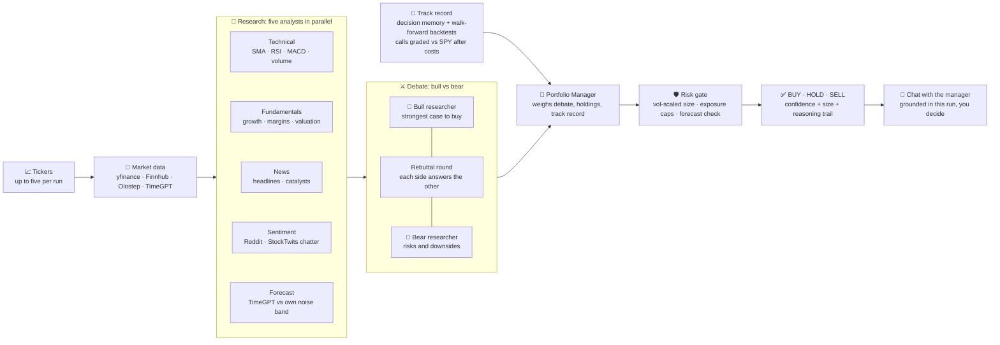

<div align="center">


**Real-time, multi-agent AI stock research and paper trading, powered by CrewAI.**

[](https://www.python.org/)
[](https://fastapi.tiangolo.com/)
[](https://www.crewai.com/)
[](https://docs.astral.sh/uv/)
[](#license)

[Highlights](#highlights) · [Quick start](#quick-start) · [Using the app](#using-the-app) · [Configuration](#configuration) · [API](#api) · [Backtesting](#backtesting) · [Wiki](https://github.com/kingabzpro/BetterTradingAgents/wiki)

</div>

---

BetterTradingAgents is an improved and streamlined version of the TradingAgents concept, with a
faster parallel workflow, live progress, explainable decisions, risk controls, and paper trading.

Enter up to five stock tickers. Specialized agents analyze technicals, fundamentals,
news, social sentiment, and the 5-day price forecast in parallel, bull and bear
researchers debate across a rebuttal round, and a risk-gated **BUY / HOLD / SELL** decision
comes back with a suggested position size and the full reasoning trail. Every completed call
is also remembered and graded against what the market actually did, so the Portfolio Manager
brings a track record to the next decision, not just fresh data.


## Highlights

| | Feature | What it means |
|:---:|---|---|
| ⚡ | **Parallel by design** | Researchers, data fetches, and debate rounds run concurrently, and multiple tickers run side by side. |
| ⚔️ | **Real debate** | Bull and bear each get a rebuttal round to answer the other's strongest points before the call. |
| 🗣️ | **Social sentiment** | A fifth researcher reads Reddit and StockTwits chatter, and says so when the crowd is too thin to mean anything. |
| ⚖️ | **Risk-gated decisions** | BUYs are volatility-scaled and capped by per-ticker, invested, and cash-buffer limits; a forecast beyond the stock's own noise band (±1σ) downgrades the trade. Downgrades are flagged, never silent. |
| 📜 | **Learns from its calls** | Every completed decision is recorded and later graded on realized return and alpha vs SPY; the manager weighs those lessons on the next run and the results page shows the track record. |
| 💬 | **Chat with the manager** | Every finished ticker gets a follow-up chat grounded in that run's research, so you can ask personalized questions and make the call yourself. |
| 🧪 | **Walk-forward backtests** | Replay the pipeline at past dates with point-in-time data only, grade every call against SPY after costs, and compare with buy-and-hold; free mock mode by default. |
| 📡 | **Live, honest progress** | Server-Sent Events stream every agent state with per-ticker progress bars and an optional live-reasoning pane. |
| 🕘 | **Durable run history** | Completed and interrupted analyses are saved in SQLite and can be reopened from the Runs page. |
| 🛡️ | **Resilient runs** | If an agent fails, the Portfolio Manager receives the available inputs and still makes a call. |
| 📊 | **Real market data** | Finnhub, Olostep, and yfinance provide fundamentals, news, and price history; Nixtla TimeGPT optionally provides a 5-day forecast. |
| 🧠 | **Model flexibility** | Use any OpenAI-compatible LLM, split by role: a cheap fast model for the researchers, a stronger one only for the final BUY/HOLD/SELL call. |
| 🪶 | **No frontend build step** | Vanilla HTML, CSS, and JavaScript are served directly by FastAPI. |

## How it works



The whole pipeline runs concurrently, tickers included, and ends in a conversation: the
manager's call is a starting view, and the per-ticker chat helps you reach your own decision.

## Quick start

You need [Python 3.12+](https://www.python.org/) and [uv](https://docs.astral.sh/uv/).

```bash
git clone https://github.com/kingabzpro/BetterTradingAgents.git
cd BetterTradingAgents
uv sync        # install dependencies
uv run setup   # interactive wizard: pick a provider, paste keys, done
uv run app     # start the app on http://127.0.0.1:8000
```

Three commands, and the wizard does the configuration for you: it offers the common LLM
providers as presets (OpenAI, Z.AI, DeepSeek, Qwen, OpenRouter, or any custom
OpenAI-compatible endpoint), hides your API key while typing, optionally tests it with a
one-token request, collects the optional market-data keys, and writes `.env`. Ctrl+C at any
prompt writes nothing.

> [!TIP]
> No LLM key yet? Leave `LLM_API_KEY` empty. The complete workflow remains available in clearly
> labeled rule-based mock mode using live market data.

Prefer configuring by hand? Copy [`.env.example`](.env.example) to `.env` and edit it; every
setting is optional and documented in [Configuration](#configuration). Keys stay in `.env`,
which is gitignored; restart the app after changing it.

For model picks (DeepSeek V4 Flash, Qwen3.8 Flash, and GLM-5.3-Flash are the recommended
starters) and per-role splits that put a cheap fast model on the researchers and a stronger
one on the final call, see the wiki's
[Configuration](https://github.com/kingabzpro/BetterTradingAgents/wiki/Configuration) page.

## Using the app

### Run your first analysis

Open [http://localhost:8000](http://localhost:8000), add tickers such as `NVDA, AMD, META`
(one at a time, paste several at once, or use the quick-add chips, up to 5), pick your
outlook (**Day trading**, **Short term**, or **Long term**) and depth (**Fast** = technical +
news + single debate round · **Medium** = all researchers · **Expert** = adds the bull/bear
rebuttal round), then select **Analyze Stocks**. The outlook is sent to every agent, so they
all weigh evidence for the horizon you actually trade; the depth trades thoroughness for speed.

Watch each agent move from waiting to running to complete, with a progress bar per ticker.
If an agent fails, its slot says so and the manager still makes a call on the inputs that
survived.


### Read the results

The summary row shows the final call with its evidence-strength label, current price, your
horizon, data age (stale and cached states included), analyst coverage with a compact signal
split such as `3 bullish / 1 neutral / 1 bearish`, the risk summary, and the estimated model
cost of the run. When the deterministic risk gate overrides the manager, the call renders as
`Manager: BUY -> Final: HOLD` with the exact flag that caused it.

Expand any ticker to read the decision brief in one order: manager conclusion, the conditions
that would change the call (`would_upgrade_if` / `would_downgrade_if`, labeled as conditions,
not alerts), risk changes, the bull-versus-bear debate including rebuttals, analyst evidence,
sources with links, and the track record of previous calls graded against SPY.


### Chat with the Portfolio Manager

Once a ticker finishes, its result card gets a **Chat with Portfolio Manager** button that
opens a per-ticker conversation grounded in that run's research, the debate, and your current
holdings. Ask anything personalized, such as whether the stock fits goals beyond this
portfolio, what would change the call, or which risk matters most. The manager answers in
plain prose, quotes the numbers from the run, and says plainly when a question reaches beyond
the research.

### I Am Feeling Lucky discovery

Select **I Am Feeling Lucky** when you want the app to find research candidates automatically.
The backend screens U.S.-listed companies (market cap between $1B and $50B, at least $100M
trailing revenue with 10% growth, and over 500,000 average daily shares traded), then ranks
them with a momentum score grounded in the published literature: 3-6 month formation momentum
that skips the most recent month, path smoothness, 52-week-high proximity, and volatility
scaling. Your chosen outlook adjusts the formation weights; the top five candidates go
straight into the ticker input and through the normal workflow. The screen is cached for an
hour, and the ranking is a research starting point, not a promise.

### Portfolio: your own holdings + paper trading

The portfolio page tracks two kinds of positions in one SQLite-backed book:

- **Tracked holdings**: shares you already own, added by ticker, quantity, and price paid
  (or imported from CSV with a row-by-row preview). They are valued at live prices and roll
  into P&L, but never touch the simulated cash balance.
- **Demo trades**: after a **BUY** recommendation, add the stock to the simulated portfolio
  in one click. Demo buys and closes move the simulated cash.

The Portfolio Manager sees all open positions when making its next call, and the risk gate's
exposure caps use the combined equity. No broker is connected and no real orders are placed.


### Run history

Every analysis is saved and listed newest-first on the **Runs** page, scoped to an anonymous
ID in your browser. A direct `?run=<id>` link reopens a specific result even after a server
restart. A running analysis can be cancelled from the live view (finished tickers are kept),
and the Runs page can rerun any finished run with its original tickers, outlook, and depth.

### Data honesty

Forecasts are supporting evidence, never targets: each one is assessed against the ±1σ
five-day move implied by the stock's own volatility, and the forecast card says so. Social
sentiment with fewer than three posts reads as neutral with low confidence, never as a
signal. Cached results keep their original timestamp and are labeled as cached. Every result
card shows an estimated model cost at provider list prices, with `cost unknown` when a model
has no known price.

## Configuration

Run `uv run setup` to configure interactively, or copy [`.env.example`](.env.example) to
`.env`. Every setting is optional; without an LLM key, the app starts in mock mode. The
settings most people touch:

| Variable | Default | Purpose |
|---|---|---|
| `LLM_BASE_URL` | `https://api.openai.com/v1` | OpenAI-compatible API endpoint |
| `LLM_API_KEY` | Not set | Enables the LLM agents (researchers, debaters, manager) |
| `LLM_MODEL` | `gpt-5.6-luna` | Model used by every agent without a per-role override |
| `FINNHUB_API_KEY` | Not set | Company profiles, fundamentals, and news; falls back to yfinance |
| `OLOSTEP_API_KEY` | Not set | News search fallback and Reddit/StockTwits sentiment search |
| `NIXTLA_API_KEY` | Not set | Nixtla TimeGPT 5-day forecast; falls back to the local trend model |
| `MAX_TICKERS` | `5` | Maximum tickers accepted in one analysis |
| `STREAM_REASONING` | `0` | `1` streams agent tokens to the UI live (off by default) |

Per-role model splits, cost-estimate overrides, risk-gate caps, decision memory, and
backtest cache settings are documented in the wiki's
[Configuration](https://github.com/kingabzpro/BetterTradingAgents/wiki/Configuration) page;
the defaults live in `app/config.py`.

## API

The core endpoints:

| Method | Route | Purpose |
|:---:|---|---|
| `POST` | `/api/analyze` | Start an analysis run for one or more tickers |
| `GET` | `/api/runs/{run_id}` | Read run status and complete results |
| `GET` | `/api/runs/{run_id}/events` | Stream live progress over SSE |
| `POST` | `/api/runs/{run_id}/cancel` | Cancel a running analysis, keeping finished ticker results |
| `POST` | `/api/runs/{run_id}/chat` | Ask the portfolio manager follow-up questions |
| `GET` | `/api/portfolio` | List positions with live prices and profit/loss |
| `GET` | `/api/health` | Check configuration and provider status |

```bash
curl -X POST http://localhost:8000/api/analyze   -H "Content-Type: application/json"   -d '{"tickers":["NVDA","AMD"]}'
```

The full endpoint list, the complete result schema (pre-gate manager call, change
conditions, data quality, forecast, per-agent reports, risk output, cost estimate), and the
SSE event catalog live in the wiki's
[API](https://github.com/kingabzpro/BetterTradingAgents/wiki/API) page.

## Backtesting

The walk-forward harness answers "is the pipeline better than buy-and-hold?" It replays the
full analysis at each grid date using only data known at that date, grades every call
against SPY after costs, and compares with all-HOLD, buy-and-hold, and momentum baselines:

```bash
uv run python -m app.backtest --tickers NVDA,AMD,META --start 2026-03-01 --end 2026-06-30 --step 21
```

Mock mode is the free default; `--holdout` splits tune and untouched test dates with
bootstrap intervals, and `--paired` changes exactly one dimension at a time. The full
guide lives in the wiki's
[Backtesting](https://github.com/kingabzpro/BetterTradingAgents/wiki/Backtesting) page.

## Development

```bash
uv run test         # fast offline suite (quick wins, cost, run history, setup wizard)
uv run test chat    # one specific group
uv run test all     # every group, including the browser smoke test

uv run python scripts/smoke_llm.py   # one-shot: does the configured LLM answer?
uv run python -m app.calibration      # regenerate the calibration report, no LLM calls
```

Every check is a standalone script in `scripts/` with a docstring explaining what it
covers; the full catalog lives in the wiki's
[Testing](https://github.com/kingabzpro/BetterTradingAgents/wiki/Testing) page, and the
module-by-module walkthrough in
[Architecture](https://github.com/kingabzpro/BetterTradingAgents/wiki/Architecture).

## Roadmap

The detailed, research-backed plan lives in the wiki's
[Roadmap](https://github.com/kingabzpro/BetterTradingAgents/wiki/Roadmap) page. Shipped so
far: the decision brief with trust state, run controls, the accessibility pass, historical
confidence calibration, and the honest experiment workflow. Next up: portfolio concentration
risk, a watchlist with decision-change tracking, decision comparison with price context,
search and export, and Alpaca paper trading.

## Disclaimer

> [!WARNING]
> BetterTradingAgents is an educational project, not investment advice. The portfolio is simulated;
> nothing in this project executes real trades.

This project is an improved and streamlined implementation inspired by
[TradingAgents](https://github.com/TauricResearch/TradingAgents).

## License

MIT
