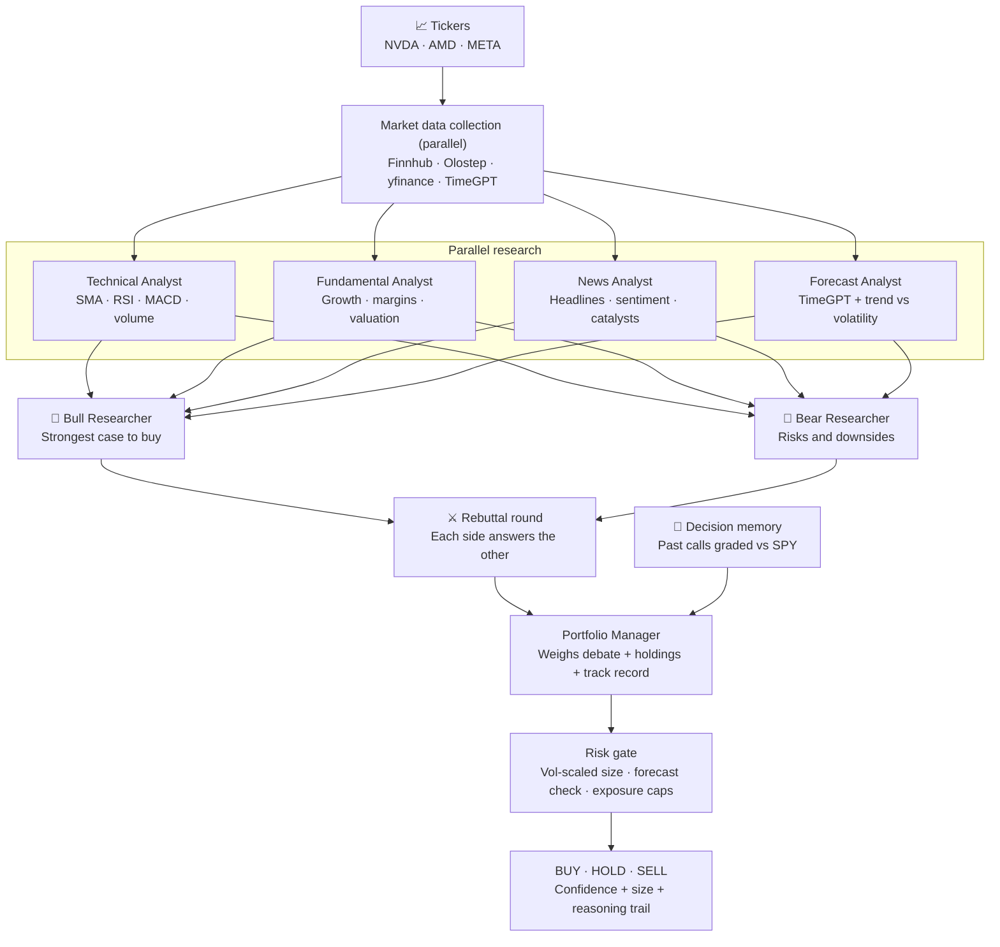

<div align="center">


**Real-time, multi-agent AI stock research and paper trading, powered by CrewAI.**

[](https://www.python.org/)
[](https://fastapi.tiangolo.com/)
[](https://www.crewai.com/)
[](https://docs.astral.sh/uv/)
[](#license)

[Highlights](#highlights) · [How it works](#how-it-works) · [Quick start](#quick-start) · [Configuration](#configuration) · [API](#api) · [Roadmap](#roadmap)

</div>

---

BetterTradingAgents is an improved and streamlined version of the TradingAgents concept, with a
faster parallel workflow, live progress, explainable decisions, risk controls, and paper trading.

Enter up to five stock tickers. Specialized agents analyze technicals, fundamentals,
news, and the 5-day price forecast in parallel, bull and bear researchers debate across
a rebuttal round, and a risk-gated **BUY / HOLD / SELL** decision comes back with a
suggested position size and the full reasoning trail. Every completed call is also
remembered and graded against what the market actually did, so the Portfolio Manager
brings a track record to the next decision, not just fresh data.


## Highlights

BetterTradingAgents turns a multi-step stock research workflow into one fast, transparent run.
Type your tickers, watch each agent work live, inspect the reasoning, and track decisions in a
simulated portfolio.

| | Feature | What it means |
|:---:|---|---|
| ⚡ | **Parallel by design** | Researchers, data fetches, and debate rounds run concurrently, and multiple tickers run side by side. |
| ⚔️ | **Real debate** | Bull and bear each get a rebuttal round to answer the other's strongest points before the call. |
| ⚖️ | **Risk-gated decisions** | BUYs are volatility-scaled and capped by per-ticker, invested, and cash-buffer limits; a 5-day forecast beyond the stock's own noise band (±1σ) downgrades the trade and one past half the band halves its size. Downgrades are flagged, never silent. |
| 📜 | **Learns from its calls** | Every completed decision is recorded and later graded on realized return and alpha vs SPY; the manager weighs those lessons on the next run and the results page shows the track record. |
| 📡 | **Live, honest progress** | Server-Sent Events stream every agent state, with per-ticker progress bars as it happens. |
| 🕘 | **Durable run history** | Completed and interrupted analyses are saved in SQLite and can be reopened from the Runs page. |
| 🛡️ | **Resilient runs** | If an agent fails, the Portfolio Manager receives the available inputs and still makes a call. |
| 📊 | **Real market data** | Finnhub, Olostep, and yfinance provide fundamentals, news, and price history; Nixtla TimeGPT optionally provides a 5-day forecast. |
| 🧠 | **Model flexibility** | Use any OpenAI-compatible LLM — and split it by role: a cheap fast model for the researchers, a stronger one only for the final BUY/HOLD/SELL call. |
| 🪶 | **No frontend build step** | Vanilla HTML, CSS, and JavaScript are served directly by FastAPI. |

## How it works



The research, data-fetch, and debate stages run concurrently with `asyncio.gather`. Multiple tickers
also run side by side, with up to five by default and one portfolio snapshot shared across the run.

### TimeGPT forecasting

Each analysis now includes a five-trading-day price forecast alongside the current price. The app
sends up to 512 historical daily closes from yfinance to Nixtla's pretrained `timegpt-1` model,
then reports the fifth predicted close and its percentage change from today's price. A dedicated
Forecast Analyst interprets that projection by weighing it against implied volatility and the local
trend fit, so the debate gets an interpreted view, not just raw numbers. Projections are supporting
evidence, never a guaranteed target or probability of profit.

TimeGPT is optional and resilient by design:

- With `NIXTLA_API_KEY`, the app uses Nixtla's hosted zero-shot forecasting API.
- Without a key, or when TimeGPT is unavailable, a local 60-day log-linear trend provides the same
  output fields so an analysis can still finish.
- The live-analysis card and completed summary identify Nixtla TimeGPT when it produced the
  forecast; otherwise they identify the local model. Forecasts remain clearly labeled as estimates.

### Decision memory

The app keeps a decision log in SQLite and learns from realized outcomes, the mechanism
TradingAgents credits for much of its edge:

- Every completed run records its call (ticker, decision, confidence, price, and both cases).
- Past decisions are graded once their evaluation window closes (`MEMORY_HORIZON_DAYS`,
  default 21 days) on realized return and alpha vs SPY from yfinance closes. Younger
  decisions get an honest partial-window grade while their window is still open.
- On the next run of the same ticker, the Portfolio Manager sees the three most recent
  graded calls plus two cross-ticker lessons, each with a one-line verdict such as
  "the bullish call beat the market" or "standing aside missed a 4.9% gain". The manager
  is instructed to treat them as weak evidence — one or two outcomes never outweigh
  current research.
- The results page shows the same track record under **What happened after previous calls**.
- Lessons are deterministic sentences by default. Set `MEMORY_REFLECT_WITH_LLM=1` to have
  the LLM write a two-sentence lesson per matured decision instead.

### Live execution

Server-Sent Events update the interface as every agent moves from waiting to running, complete,
or failed. Progress bars tick per ticker as each agent finishes.


### Explainable results

Expand any ticker to inspect the plain-English decision summary, analyst reports, the full
bull-versus-bear debate including rebuttals, the risk-sized position, any risk flags, and
the track record of previous calls graded against SPY.


## Quick start

### Prerequisites

- [Python 3.12+](https://www.python.org/)
- [uv](https://docs.astral.sh/uv/)

### 1. Clone and install

```bash
git clone https://github.com/kingabzpro/BetterTradingAgents.git
cd BetterTradingAgents
uv sync
```

### 2. Configure

```bash
cp .env.example .env
```

Add an `LLM_API_KEY` to `.env` to enable the AI agents. The default configuration uses OpenAI,
but any OpenAI-compatible endpoint can be used.

To enable the hosted forecast, sign in to the [Nixtla dashboard](https://dashboard.nixtla.io/sign_in),
open **API Keys**, create a key, and add it locally:

```env
NIXTLA_API_KEY=your_key_here
```

Keep the key in `.env`; never commit or expose it in browser-side code. Restart the app after
changing environment variables. TimeGPT is optional; the local forecast remains available without it.

> [!TIP]
> No LLM key yet? Leave `LLM_API_KEY` empty. The complete workflow remains available in clearly
> labeled rule-based mock mode using live market data.

#### Recommended models

> [!IMPORTANT]
> For the best balance of **price, accuracy, and speed**, start with DeepSeek V4 Flash,
> Qwen3.8 Flash, or GLM-5.3-Flash. Provider pricing and availability can vary by region.

| Provider | `LLM_MODEL` value | Why choose it |
|---|---|---|
| [DeepSeek](https://api-docs.deepseek.com/quick_start/pricing) | `deepseek-v4-flash` | Fast, cost-efficient general reasoning for multi-agent runs |
| [Alibaba Cloud Qwen](https://www.alibabacloud.com/help/en/model-studio/getting-started/models) | `qwen3.8-flash` | High-speed model with strong instruction following and a large context window |
| [Z.AI](https://docs.z.ai/guides/vlm/glm-5.3-flash) | `glm-5.3-flash` | Efficient reasoning with strong quality at a lower serving cost |

#### Per-role models

Set `LLM_MODEL` to the cheap fast model, then override the manager so the final
judgment runs on the stronger one — the researchers and debaters stay fast and
inexpensive while the BUY/HOLD/SELL call gets the deep model. Each role can also
point at its own endpoint and key (`LLM_BASE_URL_*` / `LLM_API_KEY_*`):

```env
LLM_MODEL=zai-org/GLM-5.3-Flash
LLM_MODEL_MANAGER=zai-org/GLM-5.3
LLM_BASE_URL_MANAGER=https://your-glm-53-endpoint/v1
```

### 3. Run

```bash
uv run uvicorn app.main:app --reload
```

Open [http://localhost:8000](http://localhost:8000), add tickers such as `NVDA, AMD, META`
(one at a time, paste several at once, or use the quick-add chips, up to 5), pick your
outlook (**Day trading**, **Short term**, or **Long term**) and depth (**Fast** = technical +
news + single debate round, 5 agents · **Medium** = all researchers, 7 agents ·
**Expert** = adds the bull/bear rebuttal round, 9 agents), then select **Analyze Stocks**.
The outlook is sent to every agent, so they all weigh evidence for the horizon you actually
trade; the depth picks how many agents run, trading thoroughness for speed.

### I Am Feeling Lucky discovery

Select **I Am Feeling Lucky** when you want the app to find research candidates automatically. The
backend screens U.S.-listed companies using these eligibility rules:

- Market capitalization above $1 billion and below $50 billion
- At least $100 million in trailing revenue
- At least 10% trailing revenue growth
- Average daily trading volume above 500,000 shares

The eligible companies are ranked with a score grounded in the published cross-sectional momentum
literature:

- **3–6 month formation momentum, skipping the most recent month** (Jegadeesh & Titman 1993;
  Jegadeesh 1990) — stocks that grinded higher over months keep working; a fresh blow-off month is
  excluded from the signal and penalized, because last-month returns tend to revert.
- **Path smoothness** (Da, Gurun & Warachka 2014, "frog in the pan") — steady climbs with many up
  days carry more persistent momentum than jumpy spikes with the same total return.
- **52-week-high proximity** (George & Hwang 2004) — nearness to the yearly high predicts returns
  better than raw momentum and does not revert long-term.
- **Volatility scaling** (Barroso & Santa-Clara 2015) — the momentum term is divided by realized
  volatility, which is the crash-reducing construction from the momentum-timing literature.

The selected Day trading, Short term, or Long term outlook changes the formation-window weights.
The five highest-ranked candidates are added to the ticker input and sent through the normal analyst,
debate, portfolio manager, and risk workflows. The ranking is a research starting point, not a
guarantee of profit or investment advice.

The backend caches the expensive market screen and price-history snapshot for 3,600 seconds. Requests
during that hour reuse the same provider data, but each outlook still calculates its own ranking. A
lock also prevents simultaneous requests from starting duplicate provider refreshes. Failed or
incomplete snapshots are not cached, and restarting the application clears the in-memory cache.

## Configuration

Copy [`.env.example`](.env.example) to `.env`, then override only what you need. Every setting is
optional; without an LLM key, the app starts in mock mode.

| Variable | Default | Purpose |
|---|---|---|
| `LLM_BASE_URL` | `https://api.openai.com/v1` | OpenAI-compatible API endpoint |
| `LLM_API_KEY` | Not set | Enables the six CrewAI agents |
| `LLM_MODEL` | `gpt-4o-mini` | Model used by every agent without a per-role override |
| `LLM_TEMPERATURE` | `0.2` | Sampling temperature |
| `LLM_TIMEOUT_SECONDS` | `90` | Timeout for each agent call |
| `LLM_REASONING_EFFORT` | Not set | Optional provider-specific reasoning effort (e.g. `none`/`low` for GLM) |
| `LLM_MODEL_MANAGER` | `LLM_MODEL` | Per-role model for the final BUY/HOLD/SELL call |
| `LLM_BASE_URL_MANAGER` / `LLM_API_KEY_MANAGER` | global values | Optional endpoint/key just for the manager |
| `LLM_MODEL_ANALYSTS` (+ `_BASE_URL_` / `_API_KEY_`) | global values | Per-role overrides for the 4 researchers |
| `LLM_MODEL_DEBATE` (+ `_BASE_URL_` / `_API_KEY_`) | global values | Per-role overrides for the bull/bear debaters |
| `FINNHUB_API_KEY` | Not set | Company profiles, fundamentals, and news; falls back to yfinance |
| `OLOSTEP_API_KEY` | Not set | News search and article scraping fallback |
| `NIXTLA_API_KEY` | Not set | Nixtla TimeGPT 5-day forecast; falls back to the local trend model |
| `MAX_TICKERS` | `5` | Maximum tickers accepted in one analysis |
| `DEBATE_ROUNDS` | `2` | Bull/bear debate depth: `1` = single round, `2`+ adds one rebuttal exchange (capped at 3) |
| `STARTING_CASH` | `100000` | Initial simulated portfolio balance |
| `DEFAULT_POSITION_SIZE` | `10000` | Suggested position value |
| `DB_PATH` | `portfolio.db` | SQLite app database path for portfolio positions and run history |
| `MAX_POSITION_PCT` | `0.10` | Risk gate: max fraction of equity in one ticker |
| `MAX_INVESTED_PCT` | `0.60` | Risk gate: max fraction of equity invested |
| `MIN_CASH_PCT` | `0.10` | Risk gate: min cash buffer after a BUY |
| `MEMORY_HORIZON_DAYS` | `21` | Decision memory: days a past call is held before its realized-return grade is final |
| `MEMORY_REFLECT_WITH_LLM` | `0` | Decision memory: `1` asks the LLM for reflection lessons instead of deterministic sentences |

## Portfolio: your own holdings + paper trading

The portfolio page tracks two kinds of positions in one SQLite-backed book:

- **Tracked holdings** — shares you already own, added on the portfolio page by entering the
  ticker, quantity, and the price you paid (blank price records at the live price), or imported
  in bulk from a CSV (`ticker,quantity,entry_price`; a header row is detected automatically and
  common aliases like `symbol` / `shares` / `avg cost` work too — download a sample from the
  page). Imports show a row-by-row preview before anything is saved. Tracked holdings are valued
  at live prices and roll into P&L, but they never touch the simulated cash balance.
- **Demo trades** — after a **BUY** recommendation, add the stock to the simulated portfolio in
  one click. Demo buys and closes move the simulated cash, and positions can be closed to
  realize gains or losses.

The Portfolio Manager agent also sees all open positions (tracked + demo) when making its next
call, and the risk gate's exposure caps use the combined equity. No broker is connected and no
real orders are placed.


## Run history

Every analysis is saved to SQLite and listed newest-first on the **Runs** page. History is scoped
to an anonymous ID stored in the browser, so one device does not list another device's runs. A
direct `?run=<id>` link can still reopen a specific result, including after a server restart.

## API

| Method | Route | Purpose |
|:---:|---|---|
| `POST` | `/api/analyze` | Start an analysis run for one or more tickers |
| `GET` | `/api/discover` | Rank liquid growth companies ($1B–$50B) with a research-grounded momentum score and return up to five research candidates |
| `GET` | `/api/runs` | List saved analysis runs, newest first |
| `DELETE` | `/api/runs` | Clear the current browser's finished run history |
| `GET` | `/api/runs/{run_id}` | Read run status and complete results |
| `GET` | `/api/runs/{run_id}/events` | Stream live progress over SSE |
| `GET` | `/api/portfolio` | List positions with live prices and profit/loss |
| `POST` | `/api/portfolio/add` | Add a simulated position |
| `POST` | `/api/portfolio/import` | Record tracked holdings (manual entry / CSV import, up to 200 per call) |
| `POST` | `/api/portfolio/close` | Close a position at the live (or given) price and realize P/L |
| `GET` | `/api/health` | Check configuration and provider status |

`GET /api/discover?outlook=short_term` returns the five ticker symbols, screen thresholds, ranking
method, cache status, and cache duration. The `cached` field reports whether the request used the
existing snapshot, and `cache_ttl_seconds` reports the 3,600-second cache duration.

<details>
<summary><strong>Example: start an analysis</strong></summary>

```bash
curl -X POST http://localhost:8000/api/analyze \
  -H "Content-Type: application/json" \
  -d '{"tickers":["NVDA","AMD"]}'
```

</details>

Each result in `GET /api/runs/{run_id}` carries the decision (`BUY`/`HOLD`/`SELL`), confidence,
the five-day forecast (`forecast_price_5d`, `forecast_change_5d_pct`, and `forecast_method`),
plus its noise-band assessment (`forecast_band_pct`, the ±1σ five-day move implied by the
stock's own volatility, and `forecast_z`, the forecast as a multiple of that band — the manager
prompt and the risk gate both consume it), per-agent reports (including both rebuttal rounds),
and the risk gate's output: `suggested_size_usd` (the volatility-scaled position size) and
`risk_flags` (why a BUY was downgraded or confidence capped, if it was).

## Development

```bash
# Offline sanity suite: indicators, portfolio accounting + migration, risk gate
PYTHONPATH=. uv run python scripts/check_quick_wins.py
PYTHONPATH=. uv run python scripts/check_risk.py

# Offline checks for tracked holdings: CSV-style import, cash isolation, API surface
PYTHONPATH=. uv run python scripts/check_portfolio_import.py

# One-shot check that the configured LLM endpoint answers
PYTHONPATH=. uv run python scripts/smoke_llm.py
```

`check_risk.py` also runs a full mock-mode analysis end-to-end, so it needs network access for
market data. The layout is intentionally small:

```
app/
  main.py        FastAPI routes, SSE stream
  workflow.py    3-stage pipeline (research -> debate -> manager) + risk gate
  risk.py        deterministic sizing + exposure caps
  agents/        one module per agent (prompt, schema, mock fallback)
  tools/         market data (Finnhub/Olostep/yfinance), indicators
  runs.py        active run coordination and event fan-out
  run_history.py SQLite persistence for completed/interrupted runs
  memory.py      decision log + realized-return/SPY-alpha reflection
  portfolio.py   SQLite positions, closes, realized P&L
static/          vanilla HTML/CSS/JS, no build step
scripts/         sanity checks
```

## Roadmap

Detailed, research-backed plans for everything below live in [docs/ROADMAP.md](docs/ROADMAP.md).

- [x] Decision memory: learn from realized returns and SPY alpha across runs
- [x] Risk layer: volatility-scaled position sizing and exposure caps
- [x] Rebuttal round in the bull/bear debate
- [x] 5-day price forecast (Nixtla TimeGPT with local fallback) + Forecast analyst
- [x] Support per-agent model selection
- [ ] Backtest agent decisions against buy-and-hold (walk-forward)
- [ ] Stream agent reasoning while each agent works
- [ ] Add Alpaca paper-trading integration

## Disclaimer

> [!WARNING]
> BetterTradingAgents is an educational project, not investment advice. The portfolio is simulated;
> nothing in this project executes real trades.

This project is an improved and streamlined implementation inspired by
[TradingAgents](https://github.com/TauricResearch/TradingAgents).

## License

MIT
