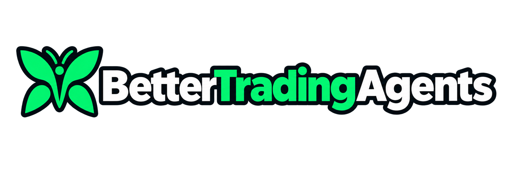
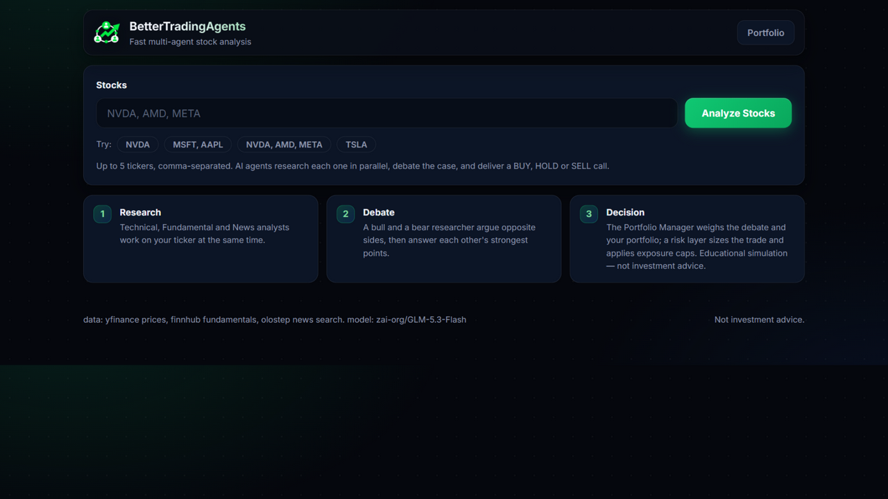
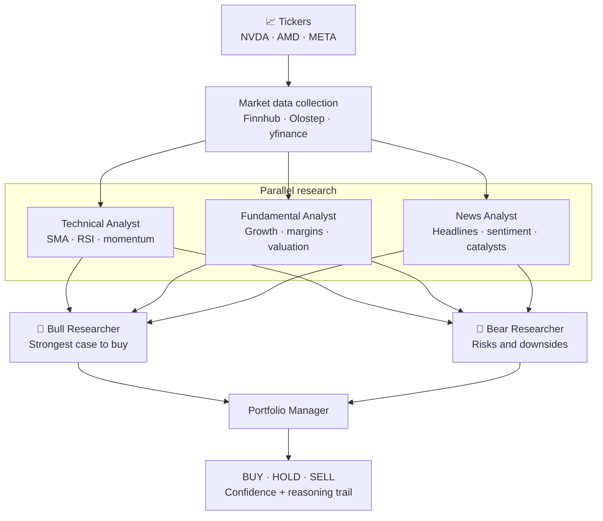
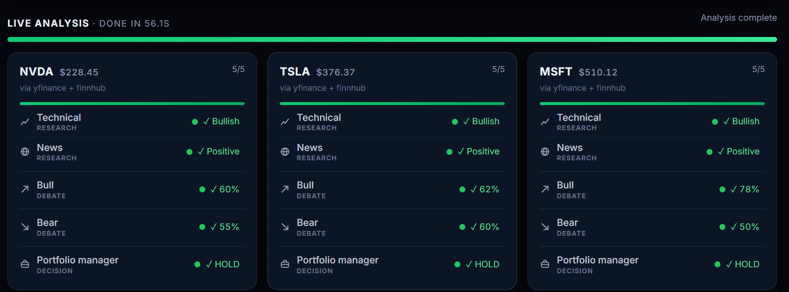
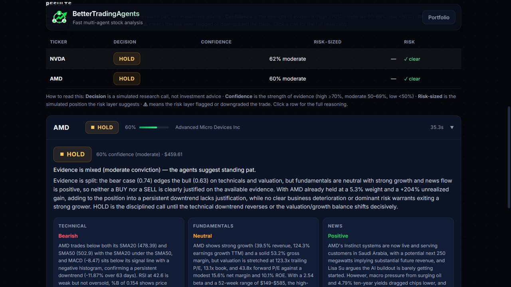
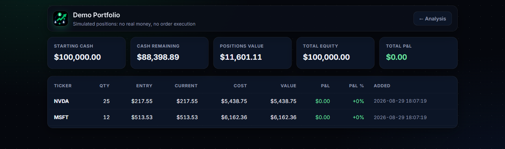

<div align="center">



**Real-time, multi-agent AI stock research and paper trading—powered by CrewAI.**

Enter up to five stock tickers. Six specialized agents analyze technicals, fundamentals, and
news in parallel, debate the bull and bear cases, and return an explainable
**BUY / HOLD / SELL** decision.

[](https://www.python.org/)
[](https://fastapi.tiangolo.com/)
[](https://www.crewai.com/)
[](https://docs.astral.sh/uv/)
[](#license)

[Highlights](#highlights) · [How it works](#how-it-works) · [Quick start](#quick-start) · [Configuration](#configuration) · [API](#api) · [Roadmap](#roadmap)

</div>

---



## Highlights

BetterTradingAgents turns a multi-step stock research workflow into one fast, transparent run.
Type your tickers, watch each agent work live, inspect the reasoning, and track decisions in a
simulated portfolio.

| | Feature | What it means |
|:---:|---|---|
| ⚡ | **Parallel by design** | Researchers run concurrently, bull and bear debate in parallel, and multiple tickers run side by side. |
| 📡 | **Live, honest progress** | Server-Sent Events stream every agent state: waiting, running, complete, or failed. |
| 🛡️ | **Resilient runs** | If an agent fails, the Portfolio Manager receives the available inputs and still makes a call. |
| 📊 | **Real market data** | Finnhub, Olostep, and yfinance provide fundamentals, news, and price history. |
| 🧠 | **Model flexibility** | Use any OpenAI-compatible LLM, including OpenRouter, DeepSeek, Qwen, GLM, vLLM, and llama.cpp. |
| 🪶 | **No frontend build step** | Vanilla HTML, CSS, and JavaScript are served directly by FastAPI. |

## How it works



The research and debate stages run concurrently with `asyncio.gather`. Multiple tickers also run
side by side—up to five by default.

### Live execution

Server-Sent Events update the interface as every agent moves from waiting to running, complete,
or failed.



### Explainable results

Expand any ticker to inspect the final decision, analyst reports, confidence scores, and the full
bull-versus-bear debate.



## Quick start

### Prerequisites

- [Python 3.12+](https://www.python.org/)
- [uv](https://docs.astral.sh/uv/)

### 1. Clone and install

```bash
git clone https://github.com/kingabzpro/BetterTradingAgents.git
cd BetterTradingAgents
uv sync
```

### 2. Configure

```bash
cp .env.example .env
```

Add an `LLM_API_KEY` to `.env` to enable the AI agents. The default configuration uses OpenAI,
but any OpenAI-compatible endpoint can be used.

> [!TIP]
> No LLM key yet? Leave `LLM_API_KEY` empty. The complete workflow remains available in clearly
> labeled rule-based mock mode using live market data.

#### Recommended models

> [!IMPORTANT]
> For the best balance of **price, accuracy, and speed**, start with DeepSeek V4 Flash,
> Qwen3.8 Flash, or GLM-5.3-Flash. Provider pricing and availability can vary by region.

| Provider | `LLM_MODEL` value | Why choose it |
|---|---|---|
| [DeepSeek](https://api-docs.deepseek.com/quick_start/pricing) | `deepseek-v4-flash` | Fast, cost-efficient general reasoning for multi-agent runs |
| [Alibaba Cloud Qwen](https://www.alibabacloud.com/help/en/model-studio/getting-started/models) | `qwen3.8-flash` | High-speed model with strong instruction following and a large context window |
| [Z.AI](https://docs.z.ai/guides/vlm/glm-5.3-flash) | `glm-5.3-flash` | Efficient reasoning with strong quality at a lower serving cost |

### 3. Run

```bash
uv run uvicorn app.main:app --reload
```

Open [http://localhost:8000](http://localhost:8000), enter tickers such as `NVDA, AMD, META`, and
select **Analyze Stocks**.

## Configuration

Copy [`.env.example`](.env.example) to `.env`, then override only what you need. Every setting is
optional; without an LLM key, the app starts in mock mode.

| Variable | Default | Purpose |
|---|---|---|
| `LLM_BASE_URL` | `https://api.openai.com/v1` | OpenAI-compatible API endpoint |
| `LLM_API_KEY` | — | Enables the six CrewAI agents |
| `LLM_MODEL` | `gpt-4o-mini` | Model used by every agent |
| `LLM_TEMPERATURE` | `0.2` | Sampling temperature |
| `LLM_TIMEOUT_SECONDS` | `90` | Timeout for each agent call |
| `LLM_REASONING_EFFORT` | — | Optional provider-specific reasoning effort |
| `FINNHUB_API_KEY` | — | Company profiles, fundamentals, and news; falls back to yfinance |
| `OLOSTEP_API_KEY` | — | News search and article scraping fallback |
| `MAX_TICKERS` | `5` | Maximum tickers accepted in one analysis |
| `DEBATE_ROUNDS` | `2` | Bull/bear debate depth: `1` = single round, `2`+ adds one rebuttal exchange (capped at 3) |
| `STARTING_CASH` | `100000` | Initial simulated portfolio balance |
| `DEFAULT_POSITION_SIZE` | `10000` | Suggested position value |
| `DB_PATH` | `portfolio.db` | SQLite portfolio database path |

## Demo portfolio

After a **BUY** recommendation, add the stock to the simulated portfolio in one click. Positions
persist in SQLite, update with live prices and profit/loss, and can be closed to realize gains or
losses — the Portfolio Manager also sees your open positions when making its next call. No broker
is connected and no real orders are placed.



## API

| Method | Route | Purpose |
|:---:|---|---|
| `POST` | `/api/analyze` | Start an analysis run for one or more tickers |
| `GET` | `/api/runs/{run_id}` | Read run status and complete results |
| `GET` | `/api/runs/{run_id}/events` | Stream live progress over SSE |
| `GET` | `/api/portfolio` | List positions with live prices and profit/loss |
| `POST` | `/api/portfolio/add` | Add a simulated position |
| `POST` | `/api/portfolio/close` | Close a position at the live (or given) price and realize P/L |
| `GET` | `/api/health` | Check configuration and provider status |

<details>
<summary><strong>Example: start an analysis</strong></summary>

```bash
curl -X POST http://localhost:8000/api/analyze \
  -H "Content-Type: application/json" \
  -d '{"tickers":["NVDA","AMD"]}'
```

</details>

## Roadmap

Detailed, research-backed plans for everything below live in [docs/ROADMAP.md](docs/ROADMAP.md).

- [ ] Decision memory: learn from realized returns and SPY alpha across runs
- [ ] Risk layer: volatility-scaled position sizing and exposure caps
- [x] Rebuttal round in the bull/bear debate
- [ ] Backtest agent decisions against buy-and-hold (walk-forward)
- [ ] Stream agent reasoning while each agent works
- [ ] Support per-agent model selection
- [ ] Add Alpaca paper-trading integration

## Disclaimer

> [!WARNING]
> BetterTradingAgents is an educational project, not investment advice. The portfolio is simulated;
> nothing in this project executes real trades.

Inspired by [TradingAgents](https://github.com/TauricResearch/TradingAgents);
this is an independent, much smaller implementation.

## License

MIT
