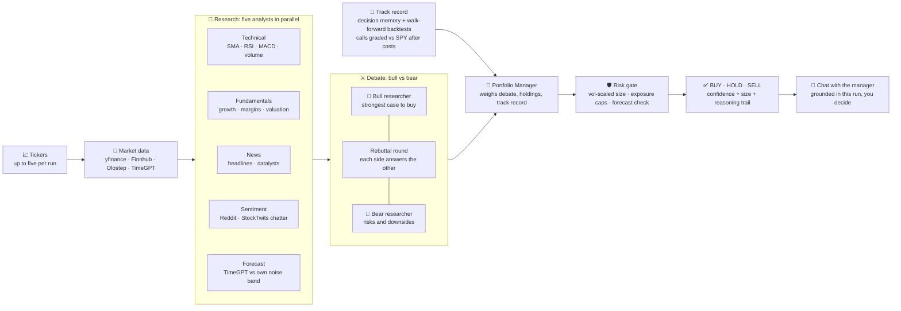

<div align="center">


**Real-time, multi-agent AI stock research and paper trading, powered by CrewAI.**

[](https://www.python.org/)
[](https://fastapi.tiangolo.com/)
[](https://www.crewai.com/)
[](https://docs.astral.sh/uv/)
[](#license)

[Highlights](#highlights) · [How it works](#how-it-works) · [Quick start](#quick-start) · [Configuration](#configuration) · [API](#api) · [Roadmap](#roadmap)

</div>

---

BetterTradingAgents is an improved and streamlined version of the TradingAgents concept, with a
faster parallel workflow, live progress, explainable decisions, risk controls, and paper trading.

Enter up to five stock tickers. Specialized agents analyze technicals, fundamentals,
news, social sentiment, and the 5-day price forecast in parallel, bull and bear
researchers debate across a rebuttal round, and a risk-gated **BUY / HOLD / SELL** decision
comes back with a suggested position size and the full reasoning trail. Every completed call
is also remembered and graded against what the market actually did, so the Portfolio Manager
brings a track record to the next decision, not just fresh data.


## Highlights

BetterTradingAgents turns a multi-step stock research workflow into one fast, transparent run.
Type your tickers, watch each agent work live, inspect the reasoning, and track decisions in a
simulated portfolio.

| | Feature | What it means |
|:---:|---|---|
| ⚡ | **Parallel by design** | Researchers, data fetches, and debate rounds run concurrently, and multiple tickers run side by side. |
| ⚔️ | **Real debate** | Bull and bear each get a rebuttal round to answer the other's strongest points before the call. |
| 🗣️ | **Social sentiment** | A fifth researcher reads Reddit and StockTwits chatter, and says so when the crowd is too thin to mean anything. |
| ⚖️ | **Risk-gated decisions** | BUYs are volatility-scaled and capped by per-ticker, invested, and cash-buffer limits; a 5-day forecast beyond the stock's own noise band (±1σ) downgrades the trade and one past half the band halves its size. Downgrades are flagged, never silent. |
| 📜 | **Learns from its calls** | Every completed decision is recorded and later graded on realized return and alpha vs SPY; the manager weighs those lessons on the next run and the results page shows the track record. |
| 💬 | **Chat with the manager** | Every finished ticker gets a follow-up chat grounded in that run's research, so you can ask personalized questions and make the call yourself. |
| 🧪 | **Walk-forward backtests** | Replay the pipeline at past dates with point-in-time data only, grade every call against SPY after costs, and compare with buy-and-hold; free mock mode by default. |
| 📡 | **Live, honest progress** | Server-Sent Events stream every agent state with per-ticker progress bars, and each agent's tokens stream into a collapsible live-reasoning pane while it thinks. |
| 🕘 | **Durable run history** | Completed and interrupted analyses are saved in SQLite and can be reopened from the Runs page. |
| 🛡️ | **Resilient runs** | If an agent fails, the Portfolio Manager receives the available inputs and still makes a call. |
| 📊 | **Real market data** | Finnhub, Olostep, and yfinance provide fundamentals, news, and price history; Nixtla TimeGPT optionally provides a 5-day forecast. |
| 🧠 | **Model flexibility** | Use any OpenAI-compatible LLM, split by role: a cheap fast model for the researchers, a stronger one only for the final BUY/HOLD/SELL call. |
| 🪶 | **No frontend build step** | Vanilla HTML, CSS, and JavaScript are served directly by FastAPI. |

## How it works



The research, data-fetch, and debate stages run concurrently with `asyncio.gather`. Multiple tickers
also run side by side, with up to five by default and one portfolio snapshot shared across the run.
The pipeline ends in a conversation: the manager's call is a starting view, and the per-ticker chat
helps you reach your own decision.

### TimeGPT forecasting

Each analysis now includes a five-trading-day price forecast alongside the current price. The app
sends up to 512 historical daily closes from yfinance to Nixtla's pretrained `timegpt-1` model,
then reports the fifth predicted close and its percentage change from today's price. A dedicated
Forecast Analyst interprets that projection by weighing it against implied volatility and the local
trend fit, so the debate gets an interpreted view, not just raw numbers. Projections are supporting
evidence, never a guaranteed target or probability of profit.

TimeGPT is optional and resilient by design:

- With `NIXTLA_API_KEY`, the app uses Nixtla's hosted zero-shot forecasting API.
- Without a key, or when TimeGPT is unavailable, a local 60-day log-linear trend provides the same
  output fields so an analysis can still finish.
- The live-analysis card and completed summary identify Nixtla TimeGPT when it produced the
  forecast; otherwise they identify the local model. Forecasts remain clearly labeled as estimates.

### Social sentiment

A Sentiment Analyst joins the research stage at Medium and Expert depth. Olostep runs a
site-restricted search (`{ticker} stock (site:reddit.com OR site:stocktwits.com)`) and the
agent reads the crowd's mood for the bull/bear debate, weighing hype skeptically rather
than mistaking bravado for conviction. Honesty about thin data is built in: fewer than three
posts reads as **neutral with low confidence** ("social volume too thin to mean anything"),
never as a signal, and the results card shows the reading with links to the underlying
threads. Without an `OLOSTEP_API_KEY` the same thin-volume neutral applies. Backtest
replays have no point-in-time social archive, so they run with an empty set and the honest
neutral reading rather than leaking present-day chatter into past dates.

### Decision memory

The app keeps a decision log in SQLite and learns from realized outcomes, the mechanism
TradingAgents credits for much of its edge:

- Every completed run records its call (ticker, decision, confidence, price, and both cases).
- Past decisions are graded once their evaluation window closes (`MEMORY_HORIZON_DAYS`,
  default 21 days) on realized return and alpha vs SPY from yfinance closes. Younger
  decisions get an honest partial-window grade while their window is still open.
- On the next run of the same ticker, the Portfolio Manager sees the three most recent
  graded calls plus two cross-ticker lessons, each with a one-line verdict such as
  "the bullish call beat the market" or "standing aside missed a 4.9% gain". The manager
  is instructed to treat them as weak evidence: one or two outcomes never outweigh
  current research.
- The results page shows the same track record under **What happened after previous calls**.
- Lessons are deterministic sentences by default. Set `MEMORY_REFLECT_WITH_LLM=1` to have
  the LLM write a two-sentence lesson per matured decision instead.

### Live execution

Server-Sent Events update the interface as every agent moves from waiting to running, complete,
or failed. Progress bars tick per ticker as each agent finishes.

An opt-in live reasoning stream exists (`STREAM_REASONING=1`): each agent's tokens fill a
collapsible pane under its row while it works. It is **off by default**: in practice, the
stream is mostly the model's final JSON blob, which reads as noise next to the result card
rather than as insight. Token events are live-only (reconnects and run history replay
results, never thousands of cosmetic chunks), a provider that rejects streaming is
auto-detected and dropped, and mock mode streams deterministic text so the path stays
testable.


### Explainable results

The summary row shows the final call with its evidence-strength label, current price, your
horizon, data age (stale and cached states included), analyst coverage with a compact signal
split such as `3 bullish / 1 neutral / 1 bearish`, and the risk summary. When the deterministic
risk gate overrides the manager, the call renders as `Manager: BUY -> Final: HOLD` with the
exact flag that caused it. Expand any ticker to read the decision brief in one order: manager
conclusion, the conditions that would change the call (`would_upgrade_if` /
`would_downgrade_if`, labeled as conditions, not alerts), risk changes, the bull-versus-bear
debate including rebuttals, analyst evidence, sources, and the track record of previous calls
graded against SPY.


### Chat with the Portfolio Manager

The BUY/HOLD/SELL call is the system's synthesized view; the decision stays with you. Once a
ticker finishes, its result card gets a **Chat with Portfolio Manager** button that opens a
per-ticker conversation grounded in that run's research, the debate, and your current
holdings. Ask anything personalized, such as whether the stock fits goals beyond this
portfolio, what would change the call, or which risk matters most. The manager answers in
plain prose, quotes the numbers from the run, and says plainly when a question reaches
beyond the research. In mock mode (no `LLM_API_KEY`) the chat mirrors the recorded call
instead of conversing.

## Quick start

### Prerequisites

- [Python 3.12+](https://www.python.org/)
- [uv](https://docs.astral.sh/uv/)

### 1. Clone and install

```bash
git clone https://github.com/kingabzpro/BetterTradingAgents.git
cd BetterTradingAgents
uv sync
```

### 2. Configure

The fastest path is the interactive setup wizard:

```bash
uv run setup
```

It offers the common LLM providers as presets (OpenAI, Z.AI, DeepSeek, Qwen, OpenRouter, or any
custom OpenAI-compatible endpoint), hides your API key while typing, optionally tests it with a
one-token request, collects the optional market-data keys, and writes `.env`. It uses only the
Python standard library, so `python scripts/setup_wizard.py` also works before dependencies are
installed, and Ctrl+C cancels at any prompt without writing anything.

Prefer doing it by hand?

```bash
cp .env.example .env
```

Add an `LLM_API_KEY` to `.env` to enable the AI agents. The default configuration uses OpenAI,
but any OpenAI-compatible endpoint can be used.

To enable the hosted forecast, sign in to the [Nixtla dashboard](https://dashboard.nixtla.io/sign_in),
open **API Keys**, create a key, and add it locally:

```env
NIXTLA_API_KEY=your_key_here
```

Keep the key in `.env`; never commit or expose it in browser-side code. Restart the app after
changing environment variables. TimeGPT is optional; the local forecast remains available without it.

> [!TIP]
> No LLM key yet? Leave `LLM_API_KEY` empty. The complete workflow remains available in clearly
> labeled rule-based mock mode using live market data.

#### Recommended models

> [!IMPORTANT]
> For the best balance of **price, accuracy, and speed**, start with DeepSeek V4 Flash,
> Qwen3.8 Flash, or GLM-5.3-Flash. Provider pricing and availability can vary by region.

| Provider | `LLM_MODEL` value | Why choose it |
|---|---|---|
| [DeepSeek](https://api-docs.deepseek.com/quick_start/pricing) | `deepseek-v4-flash` | Fast, cost-efficient general reasoning for multi-agent runs |
| [Alibaba Cloud Qwen](https://www.alibabacloud.com/help/en/model-studio/getting-started/models) | `qwen3.8-flash` | High-speed model with strong instruction following and a large context window |
| [Z.AI](https://docs.z.ai/guides/vlm/glm-5.3-flash) | `glm-5.3-flash` | Efficient reasoning with strong quality at a lower serving cost |

#### Per-role models

Set `LLM_MODEL` to the cheap fast model, then override the manager so the final
judgment runs on the stronger one; the researchers and debaters stay fast and
inexpensive while the BUY/HOLD/SELL call gets the deep model. Each role can also
point at its own endpoint and key (`LLM_BASE_URL_*` / `LLM_API_KEY_*`):

```env
LLM_MODEL=zai-org/GLM-5.3-Flash
LLM_MODEL_MANAGER=zai-org/GLM-5.3
LLM_BASE_URL_MANAGER=https://your-glm-53-endpoint/v1
```

### 3. Run

```bash
uv run app
```

Open [http://localhost:8000](http://localhost:8000), add tickers such as `NVDA, AMD, META`
(one at a time, paste several at once, or use the quick-add chips, up to 5), pick your
outlook (**Day trading**, **Short term**, or **Long term**) and depth (**Fast** = technical +
news + single debate round, 5 agents · **Medium** = all researchers, 8 agents ·
**Expert** = adds the bull/bear rebuttal round, 10 agents), then select **Analyze Stocks**.
The outlook is sent to every agent, so they all weigh evidence for the horizon you actually
trade; the depth picks how many agents run, trading thoroughness for speed.

### I Am Feeling Lucky discovery

Select **I Am Feeling Lucky** when you want the app to find research candidates automatically. The
backend screens U.S.-listed companies using these eligibility rules:

- Market capitalization above $1 billion and below $50 billion
- At least $100 million in trailing revenue
- At least 10% trailing revenue growth
- Average daily trading volume above 500,000 shares

The eligible companies are ranked with a score grounded in the published cross-sectional momentum
literature:

- **3–6 month formation momentum, skipping the most recent month** (Jegadeesh & Titman 1993;
  Jegadeesh 1990): stocks that grinded higher over months keep working; a fresh blow-off month is
  excluded from the signal and penalized, because last-month returns tend to revert.
- **Path smoothness** (Da, Gurun & Warachka 2014, "frog in the pan"): steady climbs with many up
  days carry more persistent momentum than jumpy spikes with the same total return.
- **52-week-high proximity** (George & Hwang 2004): nearness to the yearly high predicts returns
  better than raw momentum and does not revert long-term.
- **Volatility scaling** (Barroso & Santa-Clara 2015): the momentum term is divided by realized
  volatility, which is the crash-reducing construction from the momentum-timing literature.

The selected Day trading, Short term, or Long term outlook changes the formation-window weights.
The five highest-ranked candidates are added to the ticker input and sent through the normal analyst,
debate, portfolio manager, and risk workflows. The ranking is a research starting point, not a
guarantee of profit or investment advice.

The backend caches the expensive market screen and price-history snapshot for 3,600 seconds. Requests
during that hour reuse the same provider data, but each outlook still calculates its own ranking. A
lock also prevents simultaneous requests from starting duplicate provider refreshes. Failed or
incomplete snapshots are not cached, and restarting the application clears the in-memory cache.

## Configuration

Run `uv run setup` to configure interactively, or copy
[`.env.example`](.env.example) to `.env` and override only what you need. Every setting is
optional; without an LLM key, the app starts in mock mode. The groups below mirror the sections
of `.env.example`, and the defaults live in `app/config.py`.

### LLM

Any OpenAI-compatible endpoint. Pair a cheap fast model with the researchers and a stronger one
with the manager via the per-role overrides.

| Variable | Default | Purpose |
|---|---|---|
| `LLM_BASE_URL` | `https://api.openai.com/v1` | OpenAI-compatible API endpoint |
| `LLM_API_KEY` | Not set | Enables the LLM agents (researchers, debaters, manager) |
| `LLM_MODEL` | `gpt-5.6-luna` | Model used by every agent without a per-role override |
| `LLM_TEMPERATURE` | `0.2` | Sampling temperature |
| `LLM_TIMEOUT_SECONDS` | `90` | Timeout for each agent call |
| `LLM_REASONING_EFFORT` | Not set | Optional provider-specific reasoning effort (e.g. `none`/`low` for GLM) |
| `LLM_PRICE_IN` / `LLM_PRICE_OUT` | `0` | Cost-estimate override in USD per 1M input/output tokens for every role (custom/proxied pricing); `0` uses the built-in list-price table in `app/cost.py` |
| `LLM_MODEL_MANAGER` | `LLM_MODEL` | Per-role model for the final BUY/HOLD/SELL call |
| `LLM_BASE_URL_MANAGER` / `LLM_API_KEY_MANAGER` | global values | Optional endpoint/key just for the manager |
| `LLM_MODEL_ANALYSTS` (+ `_BASE_URL_` / `_API_KEY_`) | global values | Per-role overrides for the 5 researchers |
| `LLM_MODEL_DEBATE` (+ `_BASE_URL_` / `_API_KEY_`) | global values | Per-role overrides for the bull/bear debaters |

### Market-data providers

All optional; each has a built-in fallback.

| Variable | Default | Purpose |
|---|---|---|
| `FINNHUB_API_KEY` | Not set | Company profiles, fundamentals, and news; falls back to yfinance |
| `OLOSTEP_API_KEY` | Not set | News search/scraping fallback and Reddit/StockTwits sentiment search |
| `NIXTLA_API_KEY` | Not set | Nixtla TimeGPT 5-day forecast; falls back to the local trend model |

### Analysis

| Variable | Default | Purpose |
|---|---|---|
| `MAX_TICKERS` | `5` | Maximum tickers accepted in one analysis |
| `DEBATE_ROUNDS` | `2` | Bull/bear debate depth: `1` = single round, `2`+ adds one rebuttal exchange (capped at 3) |
| `STREAM_REASONING` | `0` | Live reasoning stream: `1` streams agent tokens to the UI (off by default: the stream is mostly the final JSON and reads as noise) |

### Demo portfolio and storage

| Variable | Default | Purpose |
|---|---|---|
| `STARTING_CASH` | `100000` | Initial simulated portfolio balance |
| `DEFAULT_POSITION_SIZE` | `10000` | Suggested position value |
| `DB_PATH` | `portfolio.db` | SQLite app database path for portfolio positions and run history |

### Risk gate

Fractions of total equity applied to every BUY.

| Variable | Default | Purpose |
|---|---|---|
| `MAX_POSITION_PCT` | `0.10` | Max fraction of equity in one ticker |
| `MAX_INVESTED_PCT` | `0.60` | Max fraction of equity invested |
| `MIN_CASH_PCT` | `0.10` | Min cash buffer after a BUY |

### Decision memory and calibration

| Variable | Default | Purpose |
|---|---|---|
| `MEMORY_HORIZON_DAYS` | `21` | Days a past call is held before its realized-return grade is final |
| `MEMORY_REFLECT_WITH_LLM` | `0` | `1` asks the LLM for reflection lessons instead of deterministic sentences |
| `CALIBRATION_MIN_OBSERVATIONS` | `30` | Minimum mature graded decisions before a confidence bucket shows a track record instead of `Track record unavailable` |

### Backtests

| Variable | Default | Purpose |
|---|---|---|
| `BACKTEST_CACHE` | `docs/backtests/cache.db` | SQLite snapshot cache location (gitignored) |
| `BACKTEST_OFFLINE` | `0` | `1` makes cache misses fail instead of hitting the network (proves warm re-runs are truly offline) |

## Portfolio: your own holdings + paper trading

The portfolio page tracks two kinds of positions in one SQLite-backed book:

- **Tracked holdings**: shares you already own, added on the portfolio page by entering the
  ticker, quantity, and the price you paid (blank price records at the live price), or imported
  in bulk from a CSV (`ticker,quantity,entry_price`; a header row is detected automatically and
  common aliases like `symbol` / `shares` / `avg cost` work too; download a sample from the
  page). Imports show a row-by-row preview before anything is saved. Tracked holdings are valued
  at live prices and roll into P&L, but they never touch the simulated cash balance.
- **Demo trades**: after a **BUY** recommendation, add the stock to the simulated portfolio in
  one click. Demo buys and closes move the simulated cash, and positions can be closed to
  realize gains or losses.

The Portfolio Manager agent also sees all open positions (tracked + demo) when making its next
call, and the risk gate's exposure caps use the combined equity. No broker is connected and no
real orders are placed.


## Run history

Every analysis is saved to SQLite and listed newest-first on the **Runs** page. History is scoped
to an anonymous ID stored in the browser, so one device does not list another device's runs. A
direct `?run=<id>` link can still reopen a specific result, including after a server restart.
A running analysis can be cancelled from the live view; tickers that already finished are kept,
and the Runs page can rerun any finished run with its original tickers, outlook, and depth.

## API

| Method | Route | Purpose |
|:---:|---|---|
| `POST` | `/api/analyze` | Start an analysis run for one or more tickers |
| `GET` | `/api/discover` | Rank liquid growth companies ($1B–$50B) with a research-grounded momentum score and return up to five research candidates |
| `GET` | `/api/runs` | List saved analysis runs, newest first |
| `DELETE` | `/api/runs` | Clear the current browser's finished run history |
| `GET` | `/api/runs/{run_id}` | Read run status and complete results |
| `GET` | `/api/runs/{run_id}/events` | Stream live progress over SSE |
| `POST` | `/api/runs/{run_id}/cancel` | Cancel a running analysis, keeping finished ticker results (repeated requests are harmless) |
| `POST` | `/api/runs/{run_id}/chat` | Ask the portfolio manager follow-up questions about one ticker of a run (grounded in that run's results) |
| `GET` | `/api/portfolio` | List positions with live prices and profit/loss |
| `POST` | `/api/portfolio/add` | Add a simulated position |
| `POST` | `/api/portfolio/import` | Record tracked holdings (manual entry / CSV import, up to 200 per call) |
| `POST` | `/api/portfolio/close` | Close a position at the live (or given) price and realize P/L |
| `GET` | `/api/health` | Check configuration and provider status |

`GET /api/discover?outlook=short_term` returns the five ticker symbols, screen thresholds, ranking
method, cache status, and cache duration. The `cached` field reports whether the request used the
existing snapshot, and `cache_ttl_seconds` reports the 3,600-second cache duration.

<details>
<summary><strong>Example: start an analysis</strong></summary>

```bash
curl -X POST http://localhost:8000/api/analyze \
  -H "Content-Type: application/json" \
  -d '{"tickers":["NVDA","AMD"]}'
```

</details>

Each result in `GET /api/runs/{run_id}` carries the final decision (`BUY`/`HOLD`/`SELL`) and
confidence, plus the manager's own pre-gate call (`manager_decision`,
`manager_confidence`), the two change conditions (`would_upgrade_if`,
`would_downgrade_if`), and a server-computed `data_quality` object (data timestamp,
expected/available/failed/skipped analysts, an outlook-specific staleness flag, and provider
fallbacks). It also carries the five-day forecast (`forecast_price_5d`,
`forecast_change_5d_pct`, and `forecast_method`), plus its noise-band assessment
(`forecast_band_pct`, the ±1σ five-day move implied by the stock's own volatility, and
`forecast_z`, the forecast as a multiple of that band; the manager prompt and the risk gate
both consume it), per-agent reports (including both rebuttal rounds), and the risk gate's
output: `suggested_size_usd` (the volatility-scaled position size) and `risk_flags` (why a
BUY was downgraded or confidence capped, if it was).

## Development

```bash
# Fast offline suite (quick wins, cost estimate, run history, setup wizard)
uv run test

# One specific group, or every group including the browser smoke test
uv run test chat
uv run test all

# Offline sanity suite: indicators, portfolio accounting + migration, risk gate
PYTHONPATH=. uv run python scripts/check_quick_wins.py
PYTHONPATH=. uv run python scripts/check_risk.py

# Offline checks for tracked holdings: CSV-style import, cash isolation, API surface
PYTHONPATH=. uv run python scripts/check_portfolio_import.py

# Offline checks for the sentiment analyst: thin-volume brake, provenance, hermetic e2e
PYTHONPATH=. uv run python scripts/check_sentiment.py

# Offline checks for the live reasoning stream: sink, caps, transient events, e2e
PYTHONPATH=. uv run python scripts/check_streaming.py

# Offline checks for the manager chat: dossier, validation, mock + history fallback
PYTHONPATH=. uv run python scripts/check_chat.py

# Offline checks for the decision brief: staleness by outlook, coverage, gate change
PYTHONPATH=. uv run python scripts/check_decision_brief.py

# Offline checks for run controls: cancel, rerun, partial results
PYTHONPATH=. uv run python scripts/check_run_controls.py

# Offline checks for confidence calibration: buckets, sample gate, Brier, API
PYTHONPATH=. uv run python scripts/check_calibration.py

# Automated browser smoke test: keyboard journey, focus, live regions, reflow
# (uses a system Edge/Chrome via the dev-only playwright dependency)
PYTHONPATH=. uv run python scripts/check_browser_smoke.py

# One-shot check that the configured LLM endpoint answers
PYTHONPATH=. uv run python scripts/smoke_llm.py
```

Regenerate the confidence calibration report from the decision database with
one command and no LLM calls:

```bash
uv run python -m app.calibration
```

`check_risk.py` also runs a full mock-mode analysis end-to-end, so it needs network access for
market data. The layout is intentionally small:

```
app/
  main.py        FastAPI routes, SSE stream
  workflow.py    3-stage pipeline (research -> debate -> manager) + risk gate
  chat.py        follow-up Q&A with the manager persona, grounded in a finished run
  risk.py        deterministic sizing + exposure caps
  quality.py     data-quality metadata: freshness, coverage, provider fallbacks
  backtest/      walk-forward harness (point-in-time data, grading, reports)
  agents/        one module per agent (prompt, schema, mock fallback)
  tools/         market data (Finnhub/Olostep/yfinance), indicators
  runs.py        active run coordination and event fan-out
  run_history.py SQLite persistence for completed/interrupted runs
  memory.py      decision log + realized-return/SPY-alpha reflection
  portfolio.py   SQLite positions, closes, realized P&L
static/          vanilla HTML + ES-module JS + per-page CSS, no build step
  js/            one module per concern: app entry, run lifecycle, SSE events,
                 rendering, chat, portfolio page; shared via native ES imports
  css/           base.css (tokens, chrome, shared components) plus one sheet
                 per page: analysis, history, portfolio
scripts/         sanity checks
```

## Backtesting

The walk-forward harness answers "is the pipeline better than buy-and-hold?" It
replays the full analysis at each grid date using only data known at that date:

```bash
uv run python -m app.backtest --tickers NVDA,AMD,META --start 2026-03-01 --end 2026-06-30 --step 21
```

- **Point-in-time data**: six months of OHLCV ending at each decision date and
  company news filtered to `published <= date` (anti-look-ahead, enforced in
  code). Fundamentals have no point-in-time source, so replays exclude the
  fundamental analyst by default (ROADMAP P1.2);
  `--allow-current-fundamentals` opts back into current-vintage data and the
  report carries a large look-ahead warning. Social posts have no
  point-in-time archive either, so the Sentiment Analyst replays with an
  empty set (thin-volume neutral) instead of leaking present-day chatter.
  Portfolio context and decision memory are disabled during replay so nothing
  leaks from after the date.
- **Grading**: BUY earns the window's return minus a 2×5bp round-trip cost, SELL
  scores 0 by default (long-only; `--short` grades shorts), HOLD scores 0, each
  compared with SPY over the same window. Aggregates: hit rate, cumulative
  return, Sharpe, max drawdown, buy-and-hold baseline.
- **Baselines and uncertainty (P1.2)**: every report includes an all-HOLD
  baseline, per-ticker buy-and-hold, and a deterministic momentum baseline
  under the same costs. With `--holdout YYYY-MM-DD`, dates before the holdout
  form the tune period and dates on/after it an untouched test period, each
  with its positioned sample size, a 95% bootstrap CI for mean alpha, and a
  plain verdict that refuses to promote results on thin or inconclusive
  samples.
- **Paired experiments (P1.2)**: `--paired depth=fast:expert` (also
  `rebuttals`, `forecast`, `sentiment`, `model`) runs two backtests that
  differ in exactly that one dimension, share the same snapshot cache, dates,
  costs, and seed, and reports the paired alpha difference with its own
  bootstrap interval. Tune debate depth here, not by eyeballing one report.
- **Reproducibility**: each report is written with a manifest
  (`manifest-<name>.json`) recording the code revision, decision policy
  version, configuration, a hash of every snapshot consumed, and the random
  seeds; the same manifest plus cache reproduces the same mock report.
- **Mock mode is the default**: free and deterministic. `--llm` runs the real
  agents after printing a cost estimate, and flags the result
  `memorization_risk: high` because the model's training data already contains
  historical outcomes.
- Reports land in [`docs/backtests/`](docs/backtests/) as JSON + markdown;
  snapshots are cached in SQLite (`BACKTEST_CACHE`, `BACKTEST_OFFLINE=1` makes
  cache misses fail instead of hitting the network), so re-runs with a warm
  cache make zero network calls. `uv run python scripts/backtest_smoke.py`
  regenerates the 3-ticker baseline report.

## Roadmap

The detailed, research-backed plan lives in [docs/ROADMAP.md](docs/ROADMAP.md).
The next work focuses on trust and measurable decision quality before broker
integration:

- [x] Decision brief: surface freshness, analyst coverage, disagreement, and risk changes at a glance
- [x] Run controls: cancel, rerun with the same settings, and preserve partial results
- [ ] Accessibility and small-screen completion pass
- [ ] Calibrate confidence against mature outcomes and show sample sizes
- [ ] Reproducible holdout experiments with simple baselines and no default fundamentals leakage
- [ ] Portfolio-level concentration and correlation risk
- [ ] Watchlist with decision-change tracking
- [ ] Alpaca paper trading with order review, idempotency, and full order states

Completed foundations include decision memory, deterministic risk sizing, rebuttal
debate, forecasting, per-role models, walk-forward backtests, social sentiment,
durable run history, provenance, caching, and the optional reasoning stream.

## Disclaimer

> [!WARNING]
> BetterTradingAgents is an educational project, not investment advice. The portfolio is simulated;
> nothing in this project executes real trades.

This project is an improved and streamlined implementation inspired by
[TradingAgents](https://github.com/TauricResearch/TradingAgents).

## License

MIT
