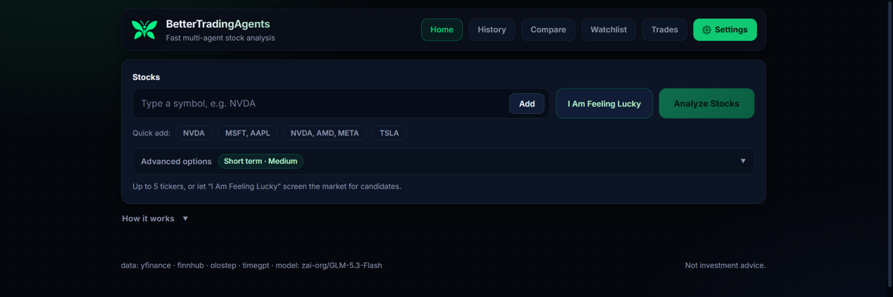
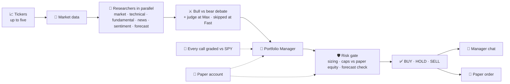

<div align="center">


**Real-time, multi-agent AI stock research and paper trading, powered by CrewAI.**

[](https://www.python.org/)
[](https://fastapi.tiangolo.com/)
[](https://www.crewai.com/)
[](https://docs.astral.sh/uv/)
[](#license)

[Highlights](#highlights) · [Quick start](#quick-start) · [Using the app](#using-the-app) · [Configuration](#configuration) · [API](#api) · [Backtesting](#backtesting) · [Track record](#live-track-record) · [Wiki](https://github.com/kingabzpro/BetterTradingAgents/wiki)

</div>

---

BetterTradingAgents is an improved and streamlined version of the TradingAgents concept, with a
faster parallel workflow, live progress, explainable decisions, risk controls, and paper trading.

Enter up to five stock tickers. Six specialized analysts read the market regime,
technicals, fundamentals, news, social sentiment, and the 5-day price forecast in
parallel; the depth tier picks the roster (Fast weighs the research directly, skipping
the debate), bull and bear researchers argue their cases with a neutral judge
cross-examining both at Max depth, and a risk-gated **BUY / HOLD / SELL** decision comes
back with a suggested position size and the full reasoning trail. Every completed call
is remembered and graded against what the market actually did, so the Portfolio Manager
brings a track record to the next decision, not just fresh data.

The design is research-backed: the multi-agent structure improves on the
[TradingAgents framework](https://arxiv.org/abs/2412.20138), and the discovery screen's
momentum score follows the published literature; the
[wiki](https://github.com/kingabzpro/BetterTradingAgents/wiki) carries the full
reference list and how each finding shapes the roadmap.



## Highlights

| | Feature | What it means |
|:---:|---|---|
| ⚡ | **Parallel by design** | Researchers, data fetches, and debate rounds run concurrently, and multiple tickers run side by side. |
| 🌍 | **Market regime** | A dedicated analyst reads the S&P 500, Nasdaq, VIX and the 10-year yield, so every call knows the weather it trades in. |
| ⚔️ | **Real debate** | Bull and bear argue their strongest cases, then a neutral judge cross-examines both against the research before the call. |
| 🗣️ | **Social sentiment** | A sixth researcher reads Reddit and StockTwits chatter, and says so when the crowd is too thin to mean anything. |
| ⚖️ | **Risk-gated decisions** | BUYs are volatility-scaled and capped against your paper account by per-ticker, invested, and cash-buffer limits; downgrades are flagged, never silent. |
| 📜 | **Learns from its calls** | Every decision is graded on realized return and alpha vs SPY; the manager weighs those lessons on the next run. |
| 💬 | **Chat with the manager** | Every finished ticker gets a follow-up chat grounded in that run's research. |
| 🧪 | **Walk-forward backtests** | Replay the pipeline at past dates with point-in-time data only, graded against SPY after costs. |
| 🕘 | **Durable history** | Completed and interrupted analyses are saved in SQLite and reopenable from the Runs page. |
| 📊 | **Real market data** | Finnhub, Olostep, and yfinance for fundamentals, news, and prices; Nixtla TimeGPT optionally forecasts. |
| 🧠 | **Model flexibility** | Any OpenAI-compatible LLM, split by role: cheap and fast for researchers, stronger for the final call. |
| 🛡️ | **Autopilot with guard rails** | Scheduled paper-trading sessions through the same risk gate and broker caps as manual clicks. |
| 🪶 | **No frontend build step** | Vanilla HTML, CSS, and JavaScript served directly by FastAPI. |

## How it works


```mermaid
flowchart LR
    T["📈 Tickers<br/>up to five"] --> D["📡 Market data"]
    D --> S["🔬 Researchers in parallel<br/>market · technical · fundamental · news · sentiment · forecast"]
    S --> B["⚔️ Bull vs bear debate<br/>+ judge at Max · skipped at Fast"]
    B --> PM["👔 Portfolio Manager"]
    TR["📜 Every call graded vs SPY"] -.-> PM
    PA["🏦 Paper account"] -.-> PM
    PM --> RG["🛡️ Risk gate<br/>sizing · caps vs paper equity · forecast check"]
    PA -.-> RG
    RG --> OUT["✅ BUY · HOLD · SELL"]
    OUT --> C["💬 Manager chat"]
    OUT --> O["🧾 Paper order"]
```

## Quick start

You need [Python 3.12+](https://www.python.org/) and [uv](https://docs.astral.sh/uv/).

```bash
git clone https://github.com/kingabzpro/BetterTradingAgents.git
cd BetterTradingAgents
uv sync        # install dependencies
uv run setup   # interactive wizard: pick a provider, paste keys, done
uv run app     # start the app on http://127.0.0.1:8000
```

The wizard offers the common LLM providers as presets, hides your API key while typing,
optionally tests it with a one-token request, and writes `.env`. Prefer configuring by hand?
Copy [`.env.example`](.env.example) to `.env`; every setting is optional.

> [!TIP]
> No LLM key yet? Leave `LLM_API_KEY` empty. The complete workflow remains available in clearly
> labeled rule-based mock mode using live market data. Everything can also be changed after
> launch on the in-app [Settings page](http://127.0.0.1:8000/settings), no restart needed.

## Using the app

| Screen | What it does |
|---|---|
| **Home** | Run an analysis for up to 5 tickers with your outlook (day / short / long term) and depth (Fast / Medium / Expert), or let **I Am Feeling Lucky** screen the market for research candidates. |
| **History** | Every run is saved with a direct `?run=<id>` link; rerun or cancel from the live view. |
| **Trades** | Your Alpaca paper account: equity curve, open positions, the order lifecycle this app placed, and per-order return vs SPY. |
| **Settings** | Every knob from `.env` editable in the app, applied live; API keys go to the OS keychain. The **Enable experimentation** switch (Analysis section) adds a tab with opt-in toggles for the retired Accuracy, Compare, and Watchlist pages. |

Watch each agent move from waiting to running to complete, with a progress bar per ticker;
if an agent fails, the manager still makes a call on the inputs that survived. The result
card ends in a conversation: expand the decision brief (conclusion, change conditions, the
bull-versus-bear debate, evidence, sources, and your track record) and chat with the manager
about the call.

With paper trading configured, the Trades page also carries the **Autopilot** card: enable it
and a background loop runs full trading sessions on a schedule, scanning the market for
candidates, adding held tickers, and submitting only the risk-gated trades it agrees with
through the same guarded broker path as a manual click. Desktop notifications can tell you
when a session finishes. Scheduled sessions only trade while the market is open; every order
is simulated paper, never live.

The full walkthrough, screen by screen, lives in the wiki's
[Usage](https://github.com/kingabzpro/BetterTradingAgents/wiki/Usage) page.

## Configuration

> [!TIP]
> Everything is editable in the app: launch it and open
> [Settings](http://127.0.0.1:8000/settings). `.env` values act as the default layer; values
> saved in the app override them, apply immediately (no restart), and **Reset to .env
> defaults** undoes them. Keys saved in the app go to your OS keychain, never into the
> database; see [Security](#security).

New here? The wiki's [Providers](https://github.com/kingabzpro/BetterTradingAgents/wiki/Providers)
page has one-click sign-up links for every key the app can use, plus which ones are optional.

The settings most people touch:

| Variable | Default | Purpose |
|---|---|---|
| `LLM_BASE_URL` | `https://api.openai.com/v1` | OpenAI-compatible API endpoint |
| `LLM_API_KEY` | Not set | Enables the LLM agents; without it the app runs in mock mode |
| `LLM_MODEL` | `gpt-5.6-luna` | Model used by every agent without a per-role override |
| `FINNHUB_API_KEY` | Not set | Fundamentals and news; falls back to yfinance |
| `OLOSTEP_API_KEY` | Not set | News search and social sentiment |
| `NIXTLA_API_KEY` | Not set | 5-day forecast; falls back to the local trend model |
| `ALPACA_API_KEY_ID` | Not set | Alpaca **paper** key; enables paper trading |
| `ALPACA_TRADING_ENABLED` | `0` | Kill switch: `1` allows order submissions |
| `AUTOMATION_*` | see `.env.example` | Autopilot knobs: interval, candidates, confidence bar, outlook, depth, sells |

Per-role model splits, cost overrides, risk caps, memory, and backtest settings are
documented in the wiki's
[Configuration](https://github.com/kingabzpro/BetterTradingAgents/wiki/Configuration) page;
the defaults live in `app/config.py`.

## Security

- Keys entered on the Settings page are stored in the OS credential vault via
  [keyring](https://pypi.org/project/keyring/): Windows Credential Manager, macOS Keychain,
  or the Linux Secret Service. They never touch the SQLite database, the API never returns a
  secret value, and nothing secret is logged. Keychain keys do not travel with a copied
  project folder; re-enter them on a new machine. Without an OS keychain, secrets fall back
  to the local database unencrypted and the Settings page says so.
- The server binds to `127.0.0.1` only; middleware additionally rejects non-loopback `Host`
  headers (DNS rebinding) and cross-site `Origin` headers, so a malicious web page in your
  browser cannot drive the local API.
- Paper trading only: the Alpaca client is built with `paper=True` hardcoded, so no
  configuration can reach live trading.

## API

| Method | Route | Purpose |
|:---:|---|---|
| `POST` | `/api/analyze` | Start an analysis run for one or more tickers |
| `GET` | `/api/runs/{run_id}` | Read run status and complete results |
| `GET` | `/api/runs/{run_id}/events` | Stream live progress over SSE |
| `POST` | `/api/runs/{run_id}/chat` | Ask the portfolio manager follow-up questions |
| `GET` | `/api/settings` | Settings page payload (secrets masked) |
| `POST` | `/api/settings` | Save settings; applied immediately, secrets to the OS keychain |
| `GET` | `/api/broker/account` | Read the Alpaca paper account |
| `POST` | `/api/broker/orders` | Place one paper order (explicit `confirm`, server-side guards) |
| `POST` | `/api/automation/run` | Fire one autopilot session now |
| `GET` | `/api/health` | Check configuration and provider status |

```bash
curl -X POST http://localhost:8000/api/analyze -H "Content-Type: application/json" -d '{"tickers":["NVDA","AMD"]}'
```

The full endpoint list, the complete result schema, and the SSE event catalog live in the
wiki's [API](https://github.com/kingabzpro/BetterTradingAgents/wiki/API) page.

## Backtesting

The walk-forward harness answers "is the pipeline better than buy-and-hold?":

```bash
uv run python -m app.backtest --tickers NVDA,AMD,META --start 2026-03-01 --end 2026-06-30 --step 21
```

Mock mode is the free default; `--holdout` splits tune and untouched test dates, and
`--paired` changes one dimension at a time. The full guide lives in the wiki's
[Backtesting](https://github.com/kingabzpro/BetterTradingAgents/wiki/Backtesting) page.

## Live track record

Every completed call is graded 21 days later against real closes: its own return and alpha
vs SPY. This scorecard is generated, not hand-written:
`uv run python scripts/benchmark.py --markdown` rebuilds it from the local run history.

As of 2026-09-30: 20 live sessions, 26 unique calls, 10 fully graded (10 still inside their
21-day window).

| What the market did next (21-day window) | The agent's record |
|---|---|
| 3 candidates fell more than 10% (MGTX -21%, BHVN -17%, TFX -12%) | 3 of 3 sidestepped |
| 8 HOLD calls | 4 avoided a 2%+ drop, 1 missed a 2%+ rally, 3 moved under 2% |
| 2 BUY calls | 0 of 2 beat SPY by more than 1% |
| Same $10,000 per signal, cash results | agent -$170 vs always-buy -$2,827 vs SPY +$547 |

Cost per analysis, measured on the same history: **$0.09 per ticker**; a typical 3-5 ticker
run lands near **$0.31** at provider list prices. Early data, stated plainly: the pattern so
far is capital preservation first; the BUY record is the weak spot, which is exactly what
the risk gate's confidence bar guards.

## Development

```bash
uv run test         # fast offline suite
uv run test chat    # one specific group
uv run test all     # every group, including the browser smoke test

uv run python scripts/smoke_llm.py   # one-shot: does the configured LLM answer?
```

Every check is a standalone script in `scripts/`; the full catalog lives in the wiki's
[Testing](https://github.com/kingabzpro/BetterTradingAgents/wiki/Testing) page, and the
module-by-module walkthrough in
[Architecture](https://github.com/kingabzpro/BetterTradingAgents/wiki/Architecture).

## Roadmap

The detailed plan lives in the wiki's
[Roadmap](https://github.com/kingabzpro/BetterTradingAgents/wiki/Roadmap) page. Shipped: the
decision brief with trust state, run controls, confidence calibration, portfolio
concentration risk, an accuracy scorecard of past calls vs realized performance
(`uv run python scripts/accuracy.py`), Alpaca paper trading with autopilot
sessions, in-app settings with OS-keychain secret storage, browser notifications, the
debate judge (one neutral cross-examination of the bull/bear cases replacing the old
self-scored rebuttal round), and the market-regime analyst with rebalanced depth tiers:
Fast (3 agents, no debate), Pro (7), Max (10) - old "medium" and "expert" values keep
working everywhere, and backtests exclude the market analyst to stay point-in-time honest.

Next up: guided first-run onboarding in the web UI, an in-app accuracy report comparing past calls with realized 21-day stock performance (the data to settle whether the judge improves graded outcomes), and search and export across past runs.

## Disclaimer

> [!WARNING]
> BetterTradingAgents is an educational project, not investment advice. The portfolio is simulated;
> nothing in this project executes real trades.

This project is an improved and streamlined implementation inspired by
[TradingAgents](https://github.com/TauricResearch/TradingAgents).

## License

MIT
